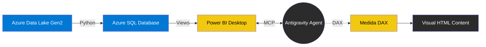

# GEMINI.md — Agent Operating Manual

## 1. Project Identity

- **Nome do Projeto:** Azure Water Quality Data Lake (AWQDL)
- **Domínio:** Saneamento Básico / Engenharia de Dados Ambiental
- **Objetivo:** Construir uma plataforma analítica automatizada de ponta a ponta (Ingestão Azure → Python ETL → Azure SQL → Power BI → DAX HTML Content) para o monitoramento da conformidade da qualidade da água.
- **Status Atual:** v1.0 validada em ambiente de desenvolvimento / BI local
- **Versão Validada:** `v1.0 Executive Dashboard`

---

## 2. Official Architecture

A arquitetura oficial do projeto não depende de aplicações web externas para exibição do dashboard. A visualização é renderizada nativamente no modelo semântico corporativo. O ambiente produtivo final só será estabelecido após deploy governado no Power BI Service; atualmente, a solução está validada em ambiente de desenvolvimento / BI local.

**Azure Data Lake → Python → Azure SQL → Power BI → MCP → DAX → HTML Content**

---

## 3. Agent Mission

O agente desempenha o papel de **Arquiteto de Dados e Desenvolvedor BI**.
- Executar somente as tarefas estritamente solicitadas.
- Respeitar incondicionalmente o escopo e as regras deste documento.
- Validar cada passo executado antes de prosseguir com alterações persistentes.
- Não inventar arquiteturas paralelas, tecnologias não listadas ou serviços em nuvem adicionais.
- Não mexer, ler, gravar, modificar ou solicitar a modificação de credenciais.

---

## 4. Operating Principles

- **Segurança Primeiro:** Nenhum segredo ou credencial no repositório versionável.
- **Validação antes da Criação:** Confirmar a viabilidade técnica e os resultados antes de efetivar alterações (ex: DAX `EVALUATE` antes de `Create`).
- **Sem Credenciais em Código:** Não injetar senhas ou strings de conexão nas medidas DAX ou visuais HTML.
- **Sem Alteração Fora do Escopo:** O pipeline Python e as views SQL não devem ser alterados a não ser por solicitação explícita.
- **Sem Hardcode de Indicadores:** O dashboard deve ler as agregações dos dados reais, não usar hardcode.
- **Sem Dashboard Externo como Fluxo Oficial:** O HTML gerado deve residir em uma medida DAX dentro do Power BI. 
- **Power BI é Camada Oficial de Apresentação:** A entrega executiva e as homologações visuais residem na ferramenta corporativa.

---

## 5. Skills Map

O agente possui instruções especializadas para gerenciar o projeto:

| Skill | Uso |
| :--- | :--- |
| `skills/01-ingestao-tratamento-qualidade-agua.md` | Ingestão, limpeza e formatação raw/processed/curated. |
| `skills/02-analise-qualidade-agua.md` | Modelagem dimensional e KPIs ambientais. |
| `skills/03-sql-json-dashboard.md` | (Fallback/Prototipagem - Não Oficial) Integração JSON para dashboards temporários locais. |
| `skills/04-visualizacao-html-awqdl.md` | Construção de DAX para o visual HTML Content. |

---

## 6. Execution Order

Ao atuar no AWQDL, o agente deve seguir estritamente o fluxo:

1. **Ler `GEMINI.md`:** Validar regras globais.
2. **Ler skill necessária:** Compreender o contexto técnico específico da tarefa.
3. **Validar estado atual:** Verificar tabelas ou medidas já existentes.
4. **Listar tabelas/campos quando usar Power BI:** Confirmar schema via MCP.
5. **Validar DAX com `EVALUATE`:** Garantir corretude sintática e de valor numérico antes de criar medidas de apresentação.
6. **Criar ou alterar medidas:** Injetar alterações no modelo Power BI via MCP.
7. **Validar resultados:** Confirmar a mudança final (ex: recarregar DAX e comparar resultado).
8. **Resumir alterações:** Produzir um resumo textual (ou walkthrough) explicando exatamente o que foi mudado.

---

## 7. Power BI MCP Rules

Quando conectado ao Model Context Protocol para atuar no Power BI:
- Conectar obrigatoriamente ao modelo aberto (`powerbi-modeling-mcp`).
- Listar tabelas sempre que necessário para evitar erros de sintaxe (ex: nomes de colunas ou relações).
- Validar DAX complexo usando a ferramenta de query (`EVALUATE`).
- Não inventar nomes de campos, medidas ou tabelas que não existem.
- Se o campo não existir, parar e reportar ao usuário.
- Criar medidas na tabela adequada (preferencialmente `vw_kpi_conformidade_geral` ou `tabela_medidas`).
- Manter medidas antigas como backup quando solicitado (ex: não apagar a versão V1 ao criar a V2).

---

## 8. Dashboard HTML Content Rules

Na geração da interface executiva:
- Todo HTML, CSS e lógica de visualização reside **dentro de uma única medida DAX**.
- Preferir `<svg>` inline construído via matemática DAX.
- Utilizar puro CSS para layout e interatividade (ex: `input type='radio'` e `:checked` para abas ou troca de tema).
- **Evitar:** CDN externas, scripts `fetch`, bibliotecas como Chart.js.
- Corrigir percentuais e escalas adequadamente (certificar-se de se o dado vem do SQL como escalar (0-100) ou decimal (0.0-1.0)).
- Não usar, de forma alguma, a inclusão de API Keys (OpenAI, Gemini, etc.) no DAX HTML para a segurança da informação do cliente.
- O botão de Relatório Executivo é apenas um *placeholder* estético. O tráfego de dados para a IA no futuro ocorrerá via API segura no backend, não no frontend do Power BI.

---

## 9. Official Validated Metrics

Valores consolidados que servem como regressão (Single Source of Truth) para validações:

| Indicador | Valor Oficial |
| :--- | :--- |
| **Total de Resultados** | 72 |
| **Total Conformes** | 50 |
| **Total Não Conformes** | 7 |
| **Sem Limite de Referência** | 15 |
| **Com Limite de Referência** | 57 |
| **% Conformidade Geral** | 69,44% |
| **% Conformidade com Limite** | 87,72% |
| **Risco NC/Limite** | 12,28% |

---

## 10. Security Rules

- **Nunca** abrir, ler, modificar ou exibir o conteúdo de `.env`.
- **Nunca** expor senhas de banco de dados nos resumos, logs ou painéis HTML.
- **Nunca** colocar chave de API de IA no DAX.
- **Nunca** colocar chave de API de IA no HTML.
- A futura funcionalidade da IA inteligente ("Relatório Executivo") será desenvolvida estritamente via **API Segura** (ex: Azure API Management) ou Azure Function, com a chave blindada como variável de ambiente fora do modelo do Power BI.

---

## 11. Prohibited Actions

🚨 **Ações explicitamente proibidas para o Agente:**
- Não criar dashboard externo (arquivos independentes `index.html`, servidor Node.js/Flask, etc) sem solicitação.
- Não substituir o Power BI Desktop pelo navegador web na arquitetura oficial.
- Não alterar o `.env`.
- Não alterar ou deletar os dados dentro de `/data/raw`.
- Não remover medidas antigas ou desabilitar relacionamentos sem autorização expressa.
- Não instalar pacotes Python via `pip` sem confirmação.
- Não criar integrações inseguras de IA fazendo chamadas `fetch` do frontend carregando token no Header.

---

## 12. Troubleshooting Runbook

| Sintoma | Diagnóstico | Ação Recomendada |
| :--- | :--- | :--- |
| **Percentual DAX exibe 6944%** | Erro de escala (Decimal vs. Escalar). | Remover o fator `* 100` e formatar: `FORMAT(medida, "0.00") & "%"`. |
| **Caracteres acentuados falham (ex: Evolu\u00e7\u00e3o)** | Falha no encoding da string no motor DAX HTML. | Substituir o acento pela sua entidade HTML (`&#231;` para ç, `&#227;` para ã). |
| **Abas HTML não trocam visual** | O JavaScript foi bloqueado no visual do Power BI. | Usar o `Checkbox Hack` (seletores CSS `:checked ~ div { display: block }`). |
| **Campos de view SQL não encontrados** | A view não foi atualizada ou há alias incorreto no SQL. | Rodar a tool de MCP listando colunas e confirmar nomes com o SQL server via Python. |

---

## 13. Versioning

- **v1.0 Executive Dashboard validado** 
- Medida principal de produção: `Visual Dashboard AWQDL Executive`
