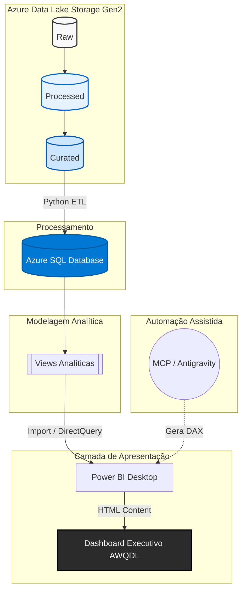
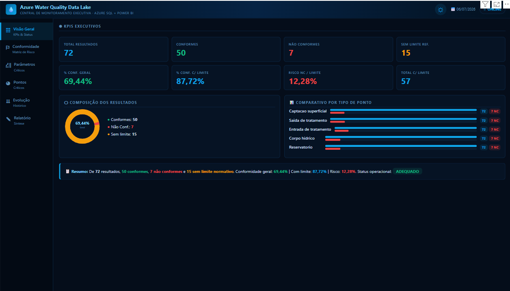

# Azure Water Quality Data Lake (AWQDL)
**Plataforma analítica para monitoramento da conformidade da qualidade da água**


---

## 1. Resumo Executivo

**O problema:** Concessionárias de saneamento lidam com volumes crescentes de dados de qualidade da água, muitas vezes dispersos em planilhas ou sistemas legados, dificultando a visão consolidada da conformidade com as normas regulatórias (ex: Portaria GM/MS nº 888).

**A solução:** O **Azure Water Quality Data Lake (AWQDL)** é uma arquitetura de dados moderna que centraliza, limpa e modela dados de ensaios de qualidade da água em um pipeline automatizado usando Microsoft Azure.

**O valor gerado:** A plataforma permite uma visão analítica confiável, rastreável e estruturada. Executivos e gerentes operacionais podem identificar rapidamente pontos críticos de não conformidade, auxiliando na tomada de decisão rápida e na garantia da segurança hídrica.

**O que foi entregue:** Um Data Lake funcional (Gen2), um modelo relacional (Star Schema) no Azure SQL, views preparadas para consumo em BI e uma versão executiva validada do Dashboard Executivo renderizado via DAX no Power BI.

---

## 2. Business Context

Em um cenário inspirado em concessionárias de saneamento (como companhias públicas e privadas de abastecimento de água), a qualidade da água não é apenas uma métrica operacional, é uma obrigação legal e uma questão de saúde pública. 

O AWQDL foi projetado com foco em:
- **Conformidade Normativa:** Monitoramento exato de parâmetros com limites estabelecidos (ex: Turbidez, Cloro Residual Livre, Coliformes).
- **Rastreabilidade:** Linhagem de dados clara, desde o arquivo raw no Data Lake até a visualização no relatório executivo.
- **Identificação de Pontos Críticos:** Ranking automático de estações de tratamento (ETA/ETE) e pontos da rede com maior incidência de não conformidades.
- **Apoio à Decisão:** Fornecer à diretoria uma visão consolidada do risco operacional (taxa de não conformidade sobre amostras com limite) em um ambiente analítico validado e interativo.

---

## 3. Arquitetura da Solução

O projeto separa armazenamento, processamento, modelagem e apresentação. O ambiente produtivo final só será estabelecido após deploy governado no Power BI Service; atualmente, a solução está validada em ambiente de desenvolvimento / BI local.



---

## 4. Lista de Figuras

| Figura | Descrição |
| :--- | :--- |
| **Figura 1** | Arquitetura lógica da solução (diagrama Mermaid acima) |
| **Figura 2** | Fluxo de dados raw/processed/curated |
| **Figura 3** | Modelo analítico SQL |
| **Figura 4** | Camada de apresentação Power BI + HTML Content |
| **Figura 5** | Preview do Dashboard executivo AWQDL (docs/assets/dashboard-executive.png) |

---

## 5. Lista de Tabelas

| Tabela | Descrição |
| :--- | :--- |
| **Tabela 1** | Modelo analítico (Dimensões e Fato) |
| **Tabela 2** | Views SQL para consumo do BI |
| **Tabela 3** | Indicadores oficiais validados (v1.0) |
| **Tabela 4** | Decisões arquiteturais do projeto |
| **Tabela 5** | Limitações conhecidas |
| **Tabela 6** | Quality Gates |
| **Tabela 7** | Roadmap de desenvolvimento |
| **Tabela 8** | Troubleshooting Runbook |

---

## 6. Pipeline de Dados

O fluxo de dados foi construído com separação lógica de responsabilidades:
1. **Ingestão Raw:** Dados brutos originais armazenados no Data Lake (Gen2), mantendo o formato original como fonte da verdade imutável.
2. **Tratamento Processed:** Limpeza de cabeçalhos, padronização de tipos de dados e tratamento de nulos via Python (pandas/PyArrow).
3. **Modelagem Curated:** Transformação dos dados em tabelas formatadas para o modelo multidimensional (Star Schema).
4. **Carga Azure SQL:** Os dados `curated` são carregados nas tabelas definitivas (`dim_` e `fato_`) no Azure SQL Database.
5. **Criação de Views:** Views analíticas (`vw_`) pré-agregam e preparam os dados para otimizar o consumo da ferramenta de BI.
6. **Consumo Power BI:** O Power BI consome as views e utiliza medidas DAX avançadas para renderizar os visuais.

---

## 7. Estrutura de Pastas

```text
azure-water-quality-data-lake/
├── .env                    # (Não versionado) Credenciais seguras
├── .gitignore
├── GEMINI.md               # Agent Operating Manual & Governança
├── README.md               # Documentação principal
├── data/
│   ├── raw/                # Arquivos brutos originais
│   ├── processed/          # Arquivos padronizados e limpos
│   └── curated/            # Modelos dimensionais prontos para SQL
├── dashboard/              # (Backup/Prototipagem) Protótipos HTML estáticos
├── docs/                   # Documentações auxiliares e assets
├── powerbi/                # Arquivos .pbix e templates
├── scripts/                # Automações em Python (ETL, carga SQL)
└── skills/                 # Instruções especializadas para IA (Antigravity)
```

---

## 8. Modelo Analítico

O banco de dados segue a modelagem dimensional (Star Schema) para otimizar as consultas analíticas e simplificar o cruzamento de dados.

**Tabela 1 — Modelo Analítico**
| Tabela | Tipo | Finalidade |
| :--- | :--- | :--- |
| `dbo.dim_ponto_coleta` | Dimensão | Cadastro de locais físicos de amostragem (ETA, ETE, Rede). |
| `dbo.dim_parametro` | Dimensão | Dicionário de parâmetros de qualidade (Cor, Turbidez, pH) e limites normativos. |
| `dbo.dim_responsavel` | Dimensão | Técnicos e laboratórios responsáveis pelas análises. |
| `dbo.dim_amostra` | Dimensão | Metadados da coleta (data, hora, condições climáticas). |
| `dbo.fato_resultado_qualidade` | Fato | Registro central dos resultados dos ensaios, centralizando as métricas. |

---

## 9. Views SQL

As views abstraem a complexidade dos JOINs, entregando tabelas com views preparadas para consumo em BI.

**Tabela 2 — Views SQL para consumo do BI**
| View | Finalidade | Uso no Dashboard |
| :--- | :--- | :--- |
| `vw_kpi_conformidade_geral` | Métricas de alto nível (totais e percentuais gerais). | Cards executivos, gráficos de composição e % de Risco. |
| `vw_analise_conformidade` | Tabela detalhada unificando Fato e Dimensões. | Tabela de "Não conformes recentes" e agrupamentos customizados. |
| `vw_conformidade_por_parametro` | Agrupamento de conformidade focado no parâmetro analisado. | Ranking de parâmetros mais críticos (Matriz/Barras). |
| `vw_conformidade_por_ponto_coleta`| Agrupamento focado no local geográfico/operacional. | Ranking de pontos de atenção e vulnerabilidade da rede. |
| `vw_evolucao_mensal_conformidade` | Agrupamento temporal (Ano/Mês) da conformidade. | Visualização de tendência histórica. |

---

## 10. Indicadores Oficiais

Estes são os valores de homologação consolidados no Azure SQL, que servem como "Single Source of Truth" para qualquer visualização gerada no projeto.

**Tabela 3 — Indicadores oficiais validados (v1.0)**
| Indicador | Valor |
| :--- | :--- |
| **Total de resultados** | 72 |
| **Total conformes** | 50 |
| **Total não conformes** | 7 |
| **Total sem limite** | 15 |
| **Total com limite** | 57 |
| **Conformidade geral** | 69,44% |
| **Conformidade com limite** | 87,72% |
| **Risco NC/Limite** | 12,28% |

> [!NOTE]
> *Qualquer alteração no pipeline, script Python ou medida DAX deve passar obrigatoriamente pelo teste de regressão destes 8 indicadores numéricos.*

---

## 11. Dashboard Executivo

O dashboard oficial do projeto, o **Visual Dashboard AWQDL Executive**, roda **dentro do Power BI Desktop** (versão executiva validada em ambiente analítico validado). Ele foi projetado via linguagem DAX concatenando strings HTML/CSS, que são renderizadas nativamente por meio do visual customizado **HTML Content**.

Essa abordagem garante:
- **Zero infraestrutura web adicional:** Não há necessidade de hospedar sites externos, configurar IIS ou App Services. O dashboard vive dentro do arquivo `.pbix`.
- **Interatividade CSS-only:** O tema Claro/Escuro e a navegação por abas utilizam a técnica de *Checkbox Hack* via CSS puro, superando as restrições de JavaScript do Power BI.
- **Desenvolvimento acelerado por IA:** A expressão DAX formata as visualizações SVG e tabelas baseada em contextos de dados calculados. A elaboração da medida foi orquestrada pela IA (Antigravity/MCP).

> [!IMPORTANT]
> **Definição de Fluxo Oficial:** O dashboard oficial roda exclusivamente no Power BI. O protótipo HTML/JS externo (`dashboard/index.html` e `dashboard/js/app.js`) serviu estritamente como experimento e fallback de design estático e local, não fazendo parte do fluxo de dados oficial de produção do projeto.

---

## 12. Segurança e Governança

- **Isolamento de Credenciais:** O arquivo `.env` gerencia as variáveis sensíveis (`DB_SERVER`, `DB_USER`, `DB_PASSWORD`) localmente para os scripts Python e está estritamente não versionado.
- **Proteção do Dashboard:** O Power BI se conecta ao Azure SQL de forma autenticada. A medida DAX (`Visual Dashboard AWQDL Executive`) e o visual HTML Content renderizado **não contêm senhas, chaves de API, nem expõem strings de conexão** no código.
- **Acesso Limitado ao Banco:** Os scripts e o Power BI possuem nível de leitura em produção (`SELECT` em views). Nenhuma operação destrutiva é feita pela camada de visualização.
- **Integração Futura com IA:** O botão "Gerar Relatório Executivo" no dashboard é apenas um *placeholder* estético. A IA ainda não está integrada em produção. A integração real utilizará uma API segura protegida (ex: Azure API Management) para injetar o contexto e retornar o relatório, garantindo que chaves de LLM jamais transitem pelo cliente.

---

## 13. Decisões Arquiteturais

**Tabela 4 — Decisões arquiteturais do projeto**
| Decisão | Justificativa |
| :--- | :--- |
| **Azure SQL como camada analítica** | Fornece forte integridade referencial, processamento rápido via Views e conexão nativa robusta com ferramentas Microsoft (Power BI). |
| **Power BI como camada executiva** | Padrão corporativo do mercado de saneamento, com segurança integrada (RLS) e facilidade de distribuição. |
| **HTML Content para entrega visual rápida** | Permite designs "pixel-perfect" e customizações UI/UX extremas impossíveis com visuais nativos, sem precisar desenvolver um site do zero. |
| **MCP/Antigravity para acelerar desenvolvimento** | Acelera radicalmente a escrita, validação (via consultas DAX remotas) e inserção de lógicas complexas no modelo semântico. |
| **IA futura via API segura** | Previne a exposição de chaves de LLMs (OpenAI/Gemini) no código cliente. A requisição será assinada no backend. |

---

## 14. Preview do Dashboard

Abaixo está o preview conceitual da interface executiva v1.0 projetada:



---

## 15. Limitações Conhecidas

**Tabela 5 — Limitações conhecidas**
| Limitação | Impacto | Próxima ação |
| :--- | :--- | :--- |
| **Processamento de IA (Relatório Executivo) não integrado** | O botão "Gerar Relatório Executivo" na UI é um placeholder sem ação real. | Desenvolver endpoint seguro em Azure Functions e configurar Azure API Management. |
| **Ambiente de visualização local** | O dashboard v1.0 está validado apenas localmente no Power BI Desktop. | Planejar deploy governado para o Power BI Service e configurar Gateway de Dados. |
| **Dependência do visual HTML Content** | Caso o visual customizado de terceiros seja desabilitado pela TI, a visualização falha. | Mapear visuais nativos do Power BI como contingência para os principais KPIs. |
| **Protótipo HTML/JS externo estático** | O diretório `dashboard/` não é atualizado automaticamente pelo ETL e usa dados estáticos mockados. | Manter apenas como referência de design ou descontinuar formalmente. |

---

## 16. Quality Gates

**Tabela 6 — Quality Gates**
| Gate | Critério | Status |
| :--- | :--- | :--- |
| **Regressão de Métricas** | Comparação dos 8 indicadores oficiais calculados contra o banco Azure SQL e medidas DAX. | ✅ Aprovado (Divergência: 0%) |
| **Segurança e Segredos** | Verificação de arquivos `.env` no histórico git e código de medidas sem chaves/senhas hardcoded. | ✅ Aprovado |
| **Sintaxe DAX/HTML** | Validação sintática e de rendering via MCP sem erros de encoding em acentuações. | ✅ Aprovado |
| **Qualidade dos Dados ETL** | Execução sem erros do script de validação de conectividade e consistência. | ✅ Aprovado |

---

## 17. Roadmap

O desenvolvimento é dividido de forma a isolar as entregas e garantir a estabilidade do ambiente analítico validado.

**Tabela 7 — Roadmap de desenvolvimento**
| Categoria | Fase | Status | Descrição |
| :--- | :--- | :--- | :--- |
| **Concluído** | Fase 1: Data Lake | ✅ Concluído | Configuração do Data Lake Storage Gen2 (raw). |
| **Concluído** | Fase 2: Processamento Python | ✅ Concluído | Processamento Python (limpeza e padronização `processed`). |
| **Concluído** | Fase 3: Curated | ✅ Concluído | Modelagem Star Schema local (`curated`). |
| **Concluído** | Fase 4: Azure SQL | ✅ Concluído | Criação das tabelas e carga no Azure SQL. |
| **Concluído** | Fase 5: Views analíticas | ✅ Concluído | Construção e homologação das views analíticas. |
| **Concluído** | Fase 6: Power BI | ✅ Concluído | Conexão e prototipação básica no Power BI. |
| **Concluído** | Fase 7: Dashboard Executive | ✅ Concluído | Implementação do HTML Content robusto via DAX (versão executiva validada). |
| **Planejado** | Fase 8: Relatório Executivo com IA | ⏳ Planejado | Integração de IA via API segura com backend blindado. |
| **Futuro** | Fase 9: Deploy e Governança | ⏳ Planejado | Deploy governado e homologação final no Power BI Service corporativo. |

---

## 18. Como executar o projeto

1. **Ativar o ambiente virtual Python:**
   ```bash
   python -m venv .venv
   source .venv/Scripts/activate  # (Linux/Mac)
   .venv\Scripts\activate         # (Windows)
   ```
2. **Carregar curated no Azure SQL:** Certifique-se de que o arquivo `.env` está configurado corretamente.
   ```bash
   python scripts/carregar_curated_sql.py
   ```
3. **Validar as views:**
   ```bash
   python scripts/teste_conexao_sql.py
   ```
4. **Abrir Power BI:**
   - Abra o arquivo `.pbix` (ou arquivo de projeto) usando o Power BI Desktop.
5. **Atualizar modelo:**
   - Realize o "Refresh" dos dados.
6. **Usar Visual Dashboard AWQDL Executive:**
   - Certifique-se de que o visual *HTML Content* está renderizando a medida.

---

## 19. Troubleshooting

**Tabela 8 — Troubleshooting Runbook**
| Problema | Causa provável | Solução |
| :--- | :--- | :--- |
| **Erro ODBC (Connection Timeout)** | IP não liberado no firewall do Azure SQL. | Acesse o portal Azure > SQL Server > Networking e adicione seu IP atual. |
| **Erro de percentual 6944%** | O DAX está multiplicando o decimal já calculado por 100 indevidamente. | Usar a medida Executive v1.0 que aplica `FORMAT(valor, "0.00") & "%"`. |
| **HTML em branco** | Visual customizado não está aprovado ou medida contém erro. | Valide o DAX. Verifique se as aspas duplas estão corretas. |
| **Credencial Power BI** | Falha de autenticação com o banco de dados. | Edite as configurações de fonte de dados no Power BI e insira a senha do banco. |
| **MCP não conecta** | Modelo do Power BI não está aberto no Desktop ou porta bloqueada. | Abra o arquivo PBIX antes de delegar tarefas ao agente. |
| **Visual HTML não renderiza JS** | HTML Content do Power BI bloqueia scripts em muitos contextos. | Use CSS puro (`:checked`) para interatividade conforme adotado no projeto. |

---

## 20. Skills e Agentes

Este projeto foi construído de forma assistida por IA:
- **GEMINI.md:** Atua como o manual de operações e governança dos agentes autônomos.
- **Skills:** Utilizadas instruções especializadas em `skills/` para ingestão, SQL e DAX.
- **MCP para Power BI:** O Model Context Protocol foi utilizado para validar expressões e modificar o modelo semântico.
- **Antigravity:** O ambiente de execução assistida gerenciou a criação do dashboard executivo com validações nativas de DAX.

---

## 21. Resultado Final

Este projeto demonstra capacidade de **engenharia de dados, cloud, modelagem analítica, BI avançado e automação assistida por IA**. Ele transforma fluxos de dados laboratoriais isolados em um pipeline robusto, auditável e altamente visual, resolvendo o problema real da falta de monitoramento gerencial consolidado para a qualidade da água em concessões.
