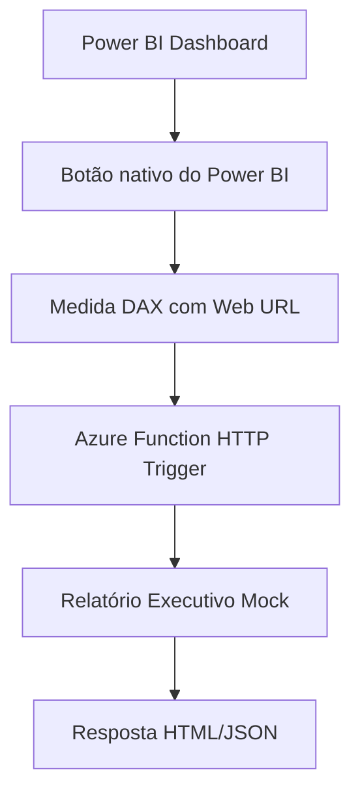

# Fase 8.1 — Power BI Button + Azure Function HTTP Mock

## 1. Objetivo
Esta fase valida o acionamento de um relatório executivo sob demanda a partir do Power BI, sem depender de Power Automate.

## 2. Motivo do pivot
O Power Automate Visual exige conta corporativa/escolar, indisponível no ambiente atual.

## 3. Arquitetura proposta



## 4. O que esta fase valida
- acionamento dentro do Power BI
- integração com Azure
- relatório sob demanda
- uso seguro de payload agregado
- ausência de segredos no DAX/HTML

## 5. O que esta fase NÃO faz
- não usa Power Automate
- não envia email
- não usa IA real
- não usa API key
- não usa Key Vault ainda
- não altera pipeline de dados

## 6. Segurança
- nenhuma chave entra no DAX
- nenhuma chave entra no HTML
- nenhuma chave entra no Power BI
- a Azure Function mock não deve exigir segredo no URL
- o payload deve conter apenas indicadores agregados
- não passar dados sensíveis em query string

## 7. Payload permitido
```json
{
  "total_resultados": 72,
  "total_conformes": 50,
  "total_nao_conformes": 7,
  "total_sem_limite": 15,
  "total_com_limite": 57,
  "percentual_conformidade_geral": 69.44,
  "percentual_conformidade_com_limite": 87.72,
  "risco_nao_conformidade_com_limite": 12.28
}
```

## 8. Medidas DAX sugeridas
- AZF Base URL AWQDL
- AZF Query Params AWQDL
- AZF Relatorio Executivo URL AWQDL
- AZF Payload Resumo AWQDL

A URL final será usada no botão do Power BI como ação Web URL.

## 9. Como usar no Power BI
- Inserir botão nativo do Power BI
- Configurar ação como Web URL
- Usar formatação condicional/fx para apontar para a medida AZF Relatorio Executivo URL AWQDL
- Clicar no botão para abrir o relatório mock retornado pela Azure Function

## 10. Roadmap técnico
- 8.1.1 Documentar fallback
- 8.1.2 Criar Azure Function HTTP mock
- 8.1.3 Criar medidas DAX de URL
- 8.1.4 Configurar botão Power BI
- 8.1.5 Testar abertura do relatório mock
- 8.1.6 Registrar evidências no README/docs
- 8.1.7 Avaliar Power Automate futuramente com conta corporativa

## 11. Critérios de aceite
- [ ] botão criado dentro do Power BI
- [ ] botão abre Azure Function
- [ ] Azure Function retorna relatório mock
- [ ] nenhum segredo exposto
- [ ] dados enviados são agregados
- [ ] dashboard original continua funcionando
